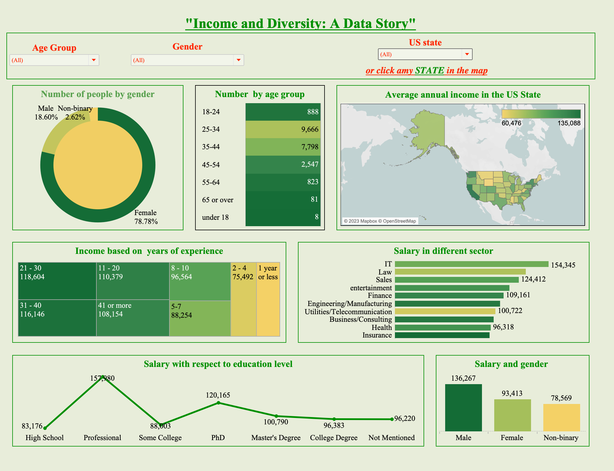

# Income Data Analysis
This repository contains a collection of scripts and data for analyzing income data from a source:   https://oscarbaruffa.com/messy/.

# Introduction
This source is one of the dirty data I encounter after doing some basic data cleaning. There were many issues in this data that I managed to overcome.
This project aims to provide a comprehensive analysis of income data from around the world, focusing on the United States during data visualization because more than 90% of datasets are relevant to the USA. The project includes data cleaning scripts And visualizations that help to uncover patterns and trends in the data.

# Data cleaning steps
1. Renaming column names: In the original data source column names were too lengthy. So before looking into the dataset, I first rename the column names in a short and appropriate way. 
2. After checking the datatypes, all the string values are converted to lower case and the extra space between the words was removed. 
3. Unique ID was given to the dataset. 
5.  Date and time column contain both date and time information as a timestamp. Firstly I  change the data type object into datetime for this column
 and make two columns containing the date and time separately. I am not going to use these dates and times (because it's survey dates and times) for visualization but it was a good exercise to separate them.
6. I dealt with the null values in every column. 
6. Text Mining: This was one of the most difficult processes to do while cleaning the data. We started to do it from working_sector columns. Steps I followed for the text mining:
- get sorted and printed unique values of the 'working_sector' column
- searched for similar-looking words
-  extract names that contain 'similar word', regardless of the case'
- Define a function to create the 'sector' column'
-  remove any special characters
7. Adding annual salary and compensation as annual income making their data types the same. 
8. Changing the currency column to uppercase with a respective abbreviation. Null values here were dealt with (first by coding and then manually) from the other_currency column and their respective working_country column.
9. Followed step 6 in order to correct the currency column. Entries with no relevant description about currency were removed and replaced by checking into working_country and city columns. 
10. Annual income was calculated but their respective currency was different. annual_income_usd was created where the annual income is converted into USD without using any libraries because it was time taking. So,  I just mentioned the exchange rate between USD and different currencies and converted. 
11. By following the same step in 6, we corrected the working country name and start the country name with the first letter uppercase and the remaining lowercase. I keep USA, UAE and UK in the uppercase.
12. In the overall_experience column I removed the term 'years' from it. 
13. I filled the null values with respective appropriate values. For e.g. in the gender column, if it was null, i replaced it with a 'not-mentioned' description. 
14. I drop the unnecessary column for the visualization. 

# Data Analysis
I have not done the significant data analysis here. However, I have used mean values in order to figure out the annual income in each country. 
For example, the average income of the USA was lower than the average income of Mexico. It looks suspicious to me and check with it. I found that the currency wasn't converted from Mexican to USD. Then I calculated the average annual_income_usd group by different sectors, cities, states, gender, race, education and so on. By calculating the mean I could modify the data where I found it suspicious and go to the base source data and take a look. 

# Data Visualization
I have done the data cleaning for almost all the parts. However, for the data visualization, I realized that including all the entries may not reflect what the data want to say as almost 90% of the dataset are from the US. In some cases, annual income from third-world countries is very high or similar to that of developed countries, especially the US. Since most of the data are for the USA, I decided to do the data visualization for the US only. At the end of the day, I think it was a good thing to do.

# Conclusion
Overall, this project was a great learning experience for me. It taught me the importance of data cleaning and the challenges that come with it. I learned various data cleaning techniques that are required to make a dataset ready for analysis. Furthermore, it taught me the importance of data visualization and how it can help us understand and interpret the data better. By doing the data analysis and visualization for the income dataset, I was able to uncover interesting patterns and trends. I would recommend anyone who is interested in data analysis to work on this dataset as it provides a great opportunity to learn and practice data cleaning and analysis techniques.

